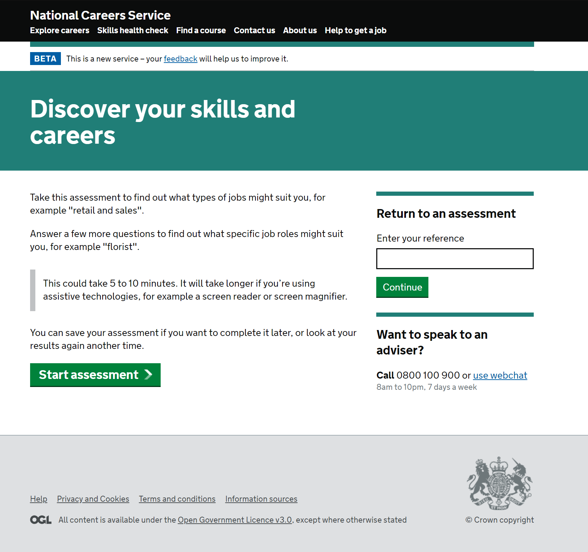

# Discover Skills and Careers

## Screenshots 

 

## Live examples

### DEV

- Web: https://dfcdevskillscareersstr.z6.web.core.windows.net
- Questions: https://dfc-dev-skillscareers-fa.azurewebsites.net/q/1?assessmentType=short

### SIT

- Web: https://dfcsitskillscareersstr.z6.web.core.windows.net
- Questons: https://dfc-sit-skillscareers-fa.azurewebsites.net/q/1?assessmentType=short


## Technical documentation  

### Architecture Documents 

[High level solution Architecture Diagram](https://drive.google.com/open?id=16ukfuSa6eKJW3lgVBvaFFobpEQ3a13D2)

### Dependencies

* Visual Studio 2017 / Visual Studio Code
* .NET Core 2.2 or higher
* [Azure Functions Tools](https://www.npmjs.com/package/azure-functions-core-tools)
* [Azure Storage Emulator](https://docs.microsoft.com/en-us/azure/storage/common/storage-use-emulator) - Note, this is included as part of the Azure SDK but a standalone installer is available for windows. Alternatively you could create a storage account on azure.
* [Azure Cosmos Emulator](https://docs.microsoft.com/en-us/azure/cosmos-db/local-emulator)

### Solution Structure

* **Dfc.DiscoverSkillsAndCareers.FunctionApp** - Contains the code for the function application deployables 
* **Dfc.DiscoverSkillsAndCareers.Models** - Any shared code that may be required.
* **Dfc.DiscoverSkillsAndCareers.Repositories** - Any data access code that is required 
* **web** - static assests to be deployed to blob service. 

### Running the application

#### Building and Running Function App

Create a local.settings.json file (change as requried but the following works with the Cosmos and Blob emulators)
```
{
    "CosmosSettings": {
        "Endpoint": "https://localhost:8081",
        "Key": "C2y6yDjf5/R+ob0N8A7Cgv30VRDJIWEHLM+4QDU5DE2nQ9nDuVTqobD4b8mGGyPMbIZnqyMsEcaGQy67XIw/Jw==",
        "DatabaseName": "TestDatabase"
    },
    "BlobStorage": {
        "StorageConnectionString": "DefaultEndpointsProtocol=http;AccountName=devstoreaccount1;AccountKey=Eby8vdM02xNOcqFlqUwJPLlmEtlCDXJ1OUzFT50uSRZ6IFsuFq2UVErCz4I6tq/K1SZFPTOtr/KBHBeksoGMGw==;BlobEndpoint=http://127.0.0.1:10000/devstoreaccount1;TableEndpoint=http://127.0.0.1:10002/devstoreaccount1;QueueEndpoint=http://127.0.0.1:10001/devstoreaccount1;",
        "ContainerName": "mycontainer"
    },
    "StaticSiteDomain": "https://dfc-dev-skillscareers-as.azurewebsites.net"
}
```
To build the function app navigate to `src/Dfc.DiscoverSkillsAndCareers.FunctionApp` and run 

    dotnet build 

to run the function app again 

    func host start

#### Building and running the front-end 

- `gulp` - Runs the build task, revisions assets, outputs to `dist` directory
- `gulp dev` - Runs the build task, starts development server with LiveReload
- `gulp test` - Runs test scripts 

#### Asset Revisioning 

Assets are revisioned using [`gulp-rev`](https://github.com/sindresorhus/gulp-rev) and references to those files are updated using [`gulp-rev-rewrite`](https://github.com/TheDancingCode/gulp-rev-rewrite). 

Note that these assets are only revisioned when the file is changed, and not every time the task is run. 

#### JavaScript 

JavaScript is written in ES6 and is compiled using Babel in order to support older browsers. 

JavaScript is linted using the [Standard](https://standardjs.com) linter, as documented in the [GOV.UK coding standards and guidelines](https://github.com/alphagov/styleguides/blob/master/js.md#linting)

### Running the test suite

#### Front-end

    cd src/web
    gulp test

#### Linting 

Sass linting config is taken from the [`gov-lint`](https://github.com/alphagov/govuk-lint/blob/master/configs/scss_lint/gds-sass-styleguide.yml) project and [converted from the “SCSS Lint” style to “Sass Lint”](http://sasstools.github.io/make-sass-lint-config/) to work with the [`sass-lint`](https://www.npmjs.com/package/sass-lint) module. 

#### Cross-browser Testing

Cross-browser testing is carried out using [BrowserStack](https://www.browserstack.com/automate/protractor). BrowserStack testing will run through happy/negative paths and is part of gulp test task. To run manually navigate to `src/web` and run

    gulp browserStack 

#### Accessibility Testing

Accessibility testing is carried out using [Pa11y](https://github.com/pa11y/pa11y). WCAG2AA is used as testing standard and is part of gulp test task. To run manually navigate to `src/web` and run

    gulp pa11y

#### Performance Testing

Performance testing is carried out using [Lighthouse](https://github.com/GoogleChrome/lighthouse#readme) and is part of gulp test task. To run manually navigate to `src/web` and run

    gulp lighthousePerformanceTest

## Deployment Structure 

There are 3 deployment artifacts 

1. **Function App** - To be deployed to the function environment.
2. **Page templates** - To be deployed to blob container.
3. **Static Landing Pages** - To be deployed to blob container. 


## Analytics 

### Event Tracking

HTML Elements

    gov-analytics-data="{{pageName}} | click | button | Start assessment"

Nunjucks partials

    {{ govukButton({
        text: "Resume progress",
        classes: "app-button",
        attributes: {
          "gov-analytics-data": pageName + " | click | button | Resume progress"
        }
      }) }}

## Licence

TODO